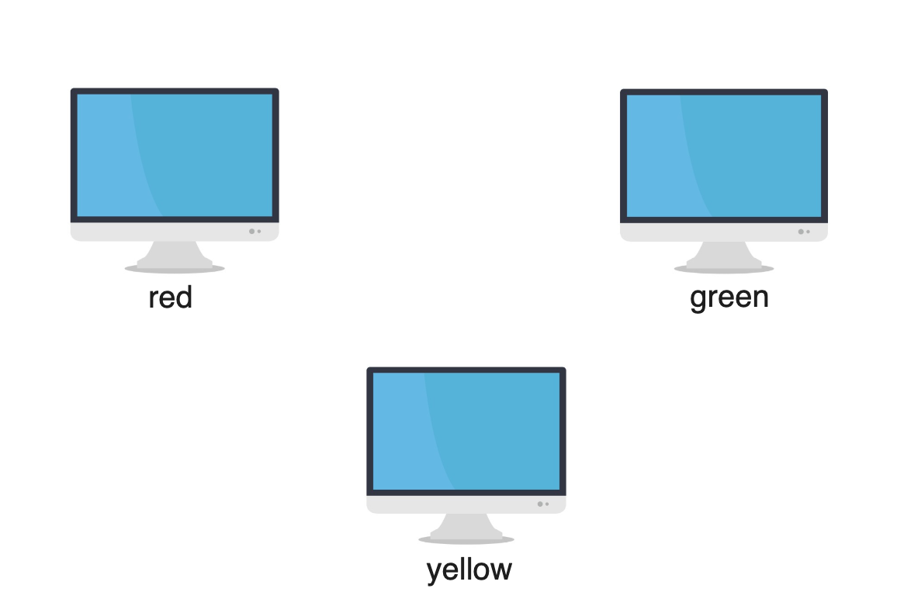
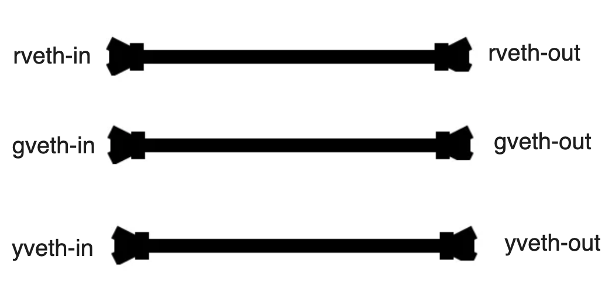
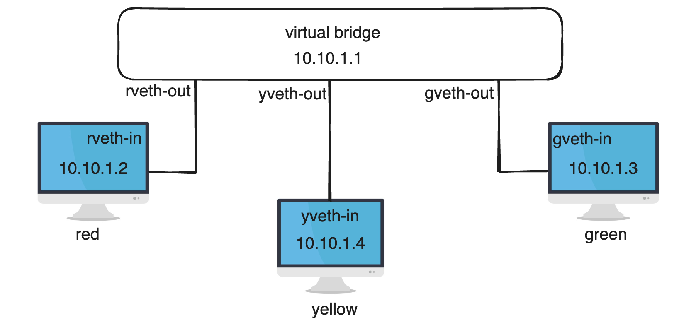

# virtual-bridge-network-namespace

We will create a virtual network bridge.Three network namespaces and one virtual ethernet device for each network space

## Create three network namespaces and virtual ethernets

    sudo ip netns add red
    sudo ip netns add green
    sudo ip netns add yellow

    sudo ip link add rveth-in type veth peer name rveth-out
    sudo ip link add gveth-in type veth peer name gveth-out
    sudo ip link add yveth-in type veth peer name yveth-out

## Show network namespace and virtual ethernets
    sudo ip netns list
    sudo ip link list

<figure >

  
   
  
Dataflow Diagram

</figure>

## Assign the virtual ethernets to the network namespaces, and set the IP addresses:

    sudo ip link set rveth-in netns red
    sudo ip link set gveth-in netns green
    sudo ip link set yveth-in netns yellow

    sudo ip netns exec red ip addr add 10.10.1.2/24 dev rveth-in
    sudo ip netns exec green ip addr add 10.10.1.3/24 dev gveth-in
    sudo ip netns exec yellow ip addr add 10.10.1.4/24 dev yveth-in

##  Create a virtual bridge device
    sudo ip link add name virtual-bridge type bridge

## Assign other ends of the virtual networks to the virtual bridge network device

    sudo ip link set rveth-out master virtual-bridge
    sudo ip link set gveth-out master virtual-bridge
    sudo ip link set yveth-out master virtual-bridge

## Enable all kinds of virtual network devices

    sudo ip link set rveth-out up
    sudo ip link set gveth-out up
    sudo ip link set yveth-out up

    sudo ip netns exec red ip link set dev rveth-in up
    sudo ip netns exec green ip link set dev gveth-in up
    sudo ip netns exec yellow ip link set dev yveth-in up

    sudo ip netns exec red ip link set dev lo up
    sudo ip netns exec green ip link set dev lo up
    sudo ip netns exec yellow ip link set dev lo up

## Assign an IP address to the virtual bridge

    sudo ip addr add 10.10.1.1/24 dev virtual-bridge

<figure >

  
  
Dataflow Diagram

</figure>

## Can the network namespaces connect to Internet?
    sudo ip netns exec red ping 8.8.8.8
    ping: connect: Network is unreachable

virtual network stacks don’t have a default gateway, they can’t go to other IP ranges.

## Add a default gateway for each network namespace

    sudo ip netns exec red ip route add default via 10.10.1.1
    sudo ip netns exec green ip route add default via 10.10.1.1
    sudo ip netns exec yellow ip route add default via 10.10.1.1
## It still doesn’t work
    sudo ip netns exec red ping 8.8.8.8
    ping: connect: Network is unreachable

It is because the main host doesn’t forward the IP packages. Besides, the main host must translate the source addresses (Masquerade / SNAT)

    sudo iptables -t nat -A POSTROUTING -s 10.10.1.0/24 -j MASQUERADE
    sysctl -w net.ipv4.ip_forward=1

    sudo ip netns exec red ping 8.8.8.8
    
    64 bytes from 8.8.8.8: icmp_seq=1 ttl=61 time=53.0 ms
    64 bytes from 8.8.8.8: icmp_seq=2 ttl=61 time=34.9 ms
    64 bytes from 8.8.8.8: icmp_seq=3 ttl=61 time=35.0 ms

